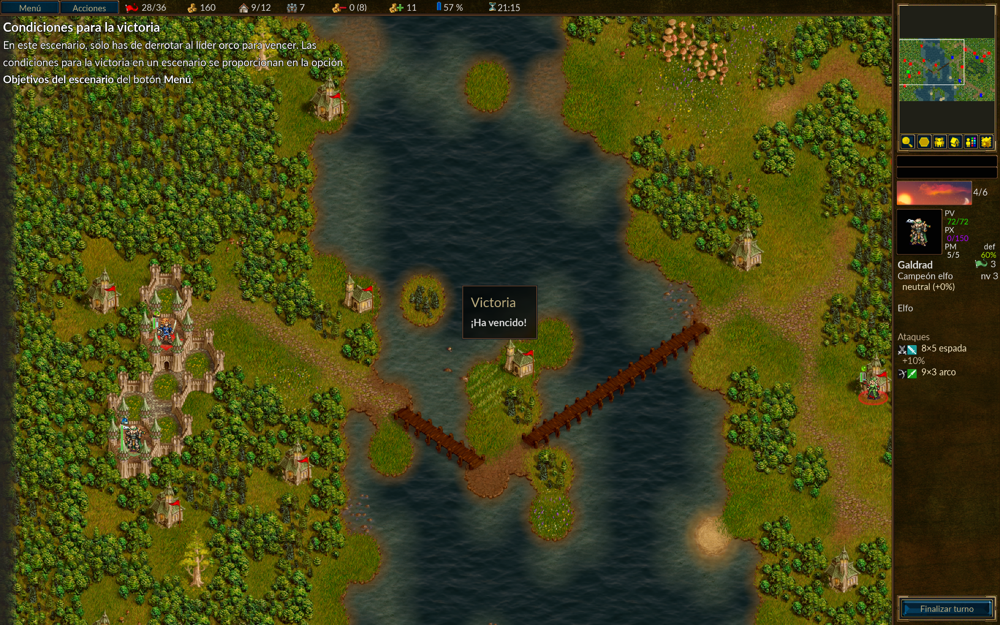

# L10N-002 — Victory message is ambiguous and inconsistent with the Tutorial's player address

## ID
L10N-002

## Title
[Spanish] Victory message is ambiguous and inconsistent with the Tutorial's player address

## Area
Tutorial → Scenario Completion → Victory Message

## Environment
- Game: The Battle for Wesnoth
- Version: 1.18.8
- Language: Spanish
- Platform: macOS
- Localization: English → Spanish

## Severity
Minor

## Priority
Medium

## Preconditions
- The game is configured in Spanish.
- The Tutorial campaign is available.
- The player is completing a Tutorial scenario.

## Steps to Reproduce
1. Launch The Battle for Wesnoth.
2. Set the game language to Spanish.
3. Start the Tutorial campaign.
4. Complete the scenario by fulfilling the victory conditions.
5. Observe the victory message displayed after the scenario is completed.

## Actual Result
The victory message is displayed as:

> «¡Ha vencido!»

The construction presents two related localization problems:

1. **Inconsistent player address**

   `ha vencido` can be interpreted as the formal second-person construction (`usted`), while the Tutorial predominantly addresses the player informally using `tú`.

   Examples of informal address observed throughout the Tutorial include:

   - «solo **has** de derrotar al líder orco para vencer»
   - «**puedes** reincorporar...»
   - «**estás** ocupando el torreón»
   - «**te** contaré más sobre ellas...»
   - «**Termina** tu turno»

2. **Ambiguous subject**

   Because the subject is omitted, «ha vencido» does not explicitly identify who has won.

   Grammatically, the construction can correspond to a third-person singular subject such as `él` or `ella`, or to the formal second-person `usted`. The subject is therefore left to be inferred from context.

   Even if the intended register were formal (`usted`), the current construction is less clear than an explicit form such as:

   > «¡Usted ha vencido!»

## Expected Result
The victory message should explicitly address the player and maintain a consistent form of address with the surrounding Tutorial content.

Preferred:

> «¡Has vencido!»

This uses the informal second-person form (`tú`) consistently with the player-address register used throughout the Tutorial.

If the localization intentionally chose the formal register (`usted`), the subject should still be explicit, for example:

> «¡Usted ha vencido!»

The current subjectless construction «¡Ha vencido!» should be avoided because it introduces ambiguity in addition to the register inconsistency.

## Impact
The message is understandable and does not prevent the player from recognizing that the scenario has been completed.

However, it introduces both:

- an inconsistent form of address compared with the surrounding Tutorial content; and
- an ambiguous grammatical subject at a prominent scenario-completion point.

This reduces the clarity, consistency, and overall quality of the Spanish localization.

## Evidence

The screenshot shows the victory message displayed after completing the Tutorial scenario:

> «Victoria»  
> «¡Ha vencido!»

## Validation
The Tutorial was reviewed in Spanish to determine the player-address register used by the surrounding content.

The Tutorial consistently uses informal second-person forms (`tú`), including `has`, `puedes`, `estás`, `te`, and informal imperative forms.

The victory message switches to `ha vencido`, creating a different form of address at the point where the scenario completion result is presented.

The message was also evaluated independently of the chosen register: even if formal `usted` were intentionally used, explicitly addressing the player as `¡Usted ha vencido!` would remove the subject ambiguity present in `¡Ha vencido!`.

## Classification
- Localization
- Grammar
- Consistency
- Player address / register
- Ambiguity

## Related Defects
- [L10N-001](./L10N-001.md) — Defeat message uses an inconsistent/ambiguous player address.
- [L10N-003](./L10N-003.md) — Main menu tip mixes informal and formal player address.

L10N-002 is a separate defect because it affects the victory message shown when completing a Tutorial scenario and combines register inconsistency with an ambiguous subject.
