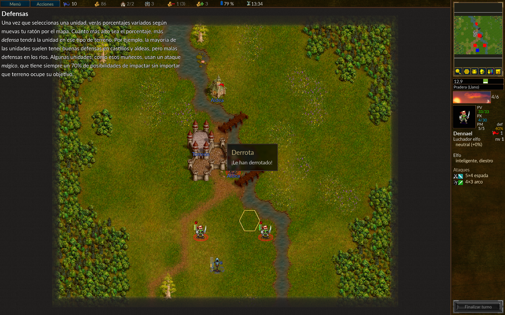
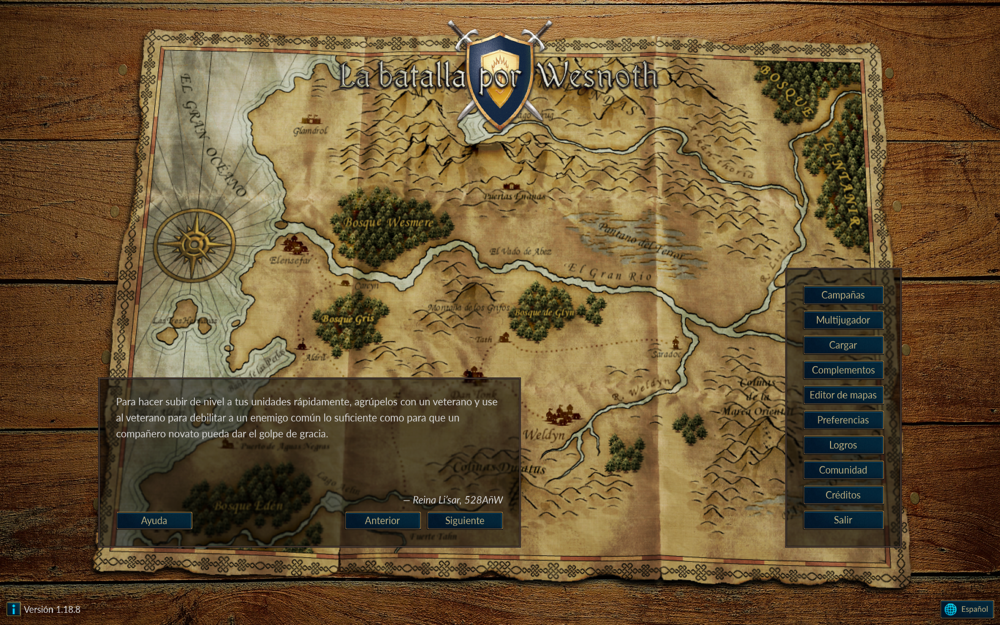
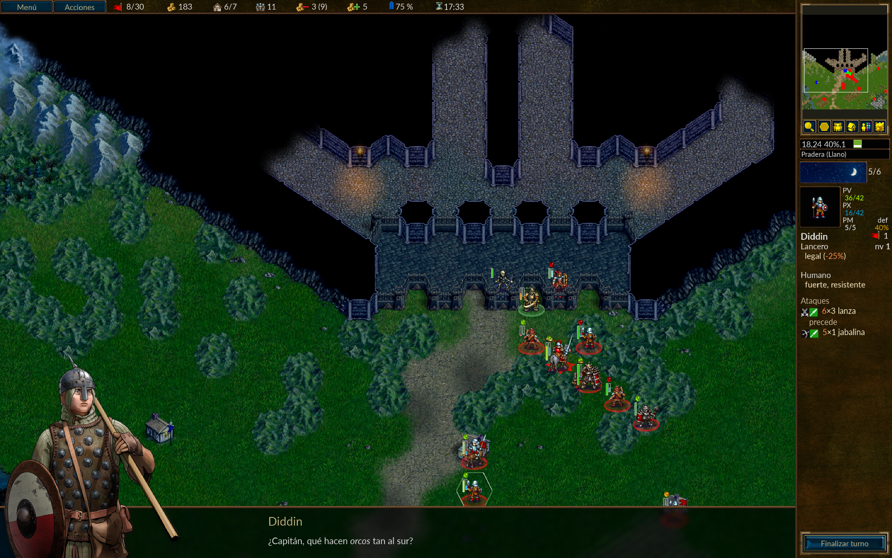

# Confirmed Localization Defects

This document consolidates the confirmed localization defects identified during the independent QA review of **The Battle for Wesnoth**.

Testing focused on English-to-Spanish localization, including translation accuracy, grammar, punctuation, terminology, register consistency, dialogue, UI text, and contextual meaning.

Only issues that were reproducible and supported by sufficient evidence were classified as confirmed defects.

---

## L10N-001 — Inconsistent and ambiguous player address in defeat message

### Summary

The Spanish Tutorial defeat message uses a formal/ambiguous grammatical construction that is inconsistent with the informal `tú` register used throughout the surrounding Tutorial content.

### Environment

- **Game:** The Battle for Wesnoth
- **Version:** 1.18.8
- **Campaign:** Tutorial
- **Language:** Spanish
- **Area:** Scenario completion / defeat message
- **Type:** Localization / Register consistency / Grammar
- **Severity:** Minor
- **Priority:** Low
- **Reproducibility:** Consistent
- **Gameplay impact:** None
- **Clarity impact:** Yes

### Steps to Reproduce

1. Launch The Battle for Wesnoth in Spanish.
2. Start the Tutorial campaign.
3. Progress until a defeat condition is triggered.
4. Observe the defeat message.

### Actual Result

The game displays:

> ¡Le han derrotado!

### Expected Result

The message should address the player consistently using the informal register established throughout the Tutorial.

A possible correction is:

> ¡Has sido derrotado!

A more gender-neutral alternative could be:

> ¡Has perdido!

### Issue Details

The Tutorial consistently uses informal second-person forms such as:

- `te`
- `estás`
- `puedes`
- `haz`

The expression `Le han derrotado` introduces an inconsistent formal/ambiguous construction.

The grammatical subject is also not clearly expressed, which reduces clarity at an important scenario-completion point.

### Classification

- **Category:** Localization
- **Subcategory:** Register consistency / Grammar
- **Status:** Confirmed defect

### Evidence

---

## L10N-002 — Ambiguous and inconsistent player address in victory message

### Summary

The Spanish Tutorial victory message uses a formal/ambiguous grammatical construction that is inconsistent with the informal `tú` register established throughout the Tutorial.

The construction also leaves the grammatical subject ambiguous.

### Environment

- **Game:** The Battle for Wesnoth
- **Version:** 1.18.8
- **Campaign:** Tutorial
- **Language:** Spanish
- **Area:** Scenario completion / victory message
- **Type:** Localization / Register consistency / Grammar
- **Severity:** Minor
- **Priority:** Low
- **Reproducibility:** Consistent
- **Gameplay impact:** None
- **Clarity impact:** Yes

### Steps to Reproduce

1. Launch The Battle for Wesnoth in Spanish.
2. Start the Tutorial campaign.
3. Complete the scenario successfully.
4. Observe the victory message.

### Actual Result

The game displays:

> Victoria  
> ¡Ha vencido!

### Expected Result

The message should maintain the informal player address used throughout the Tutorial and clearly identify the player as the subject.

A possible correction is:

> ¡Has vencido!

Alternatively, a more explicit neutral formulation could be:

> ¡Has ganado!

### Issue Details

The form `ha vencido` can grammatically correspond to:

- `él`
- `ella`
- `usted`
- another third-person subject

This creates ambiguity about who has achieved victory.

The issue is particularly noticeable because the surrounding Tutorial content consistently addresses the player using `tú`.

Even if a formal `usted` register were intentionally used, the current sentence would remain less explicit than a formulation such as:

> Usted ha vencido.

### Classification

- **Category:** Localization
- **Subcategory:** Register consistency / Grammar / Clarity
- **Status:** Confirmed defect

### Evidence

---

## L10N-003 — Mixed informal and formal player address in Main Menu tip

### Summary

A Main Menu gameplay tip mixes informal and formal forms of address within the same sentence.

### Environment

- **Game:** The Battle for Wesnoth
- **Version:** 1.18.8
- **Language:** Spanish
- **Area:** Main Menu / Gameplay Tips
- **Type:** Localization / Register consistency
- **Severity:** Minor
- **Priority:** Low
- **Reproducibility:** Consistent
- **Gameplay impact:** None
- **Clarity impact:** Low

### Steps to Reproduce

1. Launch The Battle for Wesnoth in Spanish.
2. Navigate through the Main Menu tips using the available navigation controls.
3. Locate the affected gameplay tip.
4. Review the forms of address used within the same message.

### Actual Result

The tip displays:

> Para hacer subir de nivel a tus unidades rápidamente, agrúpalos con un veterano y use al veterano para debilitar a un enemigo común lo suficiente como para que un compañero novato pueda dar el golpe de gracia.

The sentence combines informal forms:

- `tus`
- `agrúpalos`

with the formal imperative:

- `use`

### Expected Result

The message should use one consistent form of address.

For example, maintaining the informal register:

> Para hacer subir de nivel a tus unidades rápidamente, agrúpalas con un veterano y usa al veterano para debilitar a un enemigo común lo suficiente como para que un compañero novato pueda dar el golpe de gracia.

### Issue Details

The investigation covered the available Main Menu tips rather than treating a single message in isolation.

Different tips may use different registers from one message to another. This was not considered a defect by itself because the individual messages were generally internally consistent.

The defect in this case is the **mixed register within the same message**:

> `tus / agrúpalos` → informal  
> `use` → formal

This creates an objectively inconsistent player address within a single localized string.

### Classification

- **Category:** Localization
- **Subcategory:** Register consistency
- **Status:** Confirmed defect

### Evidence

---

## L10N-004 — Incorrect question punctuation and missing definite article in Spanish dialogue

### Summary

A campaign dialogue line contains incorrect Spanish question punctuation around a vocative and an unnatural noun phrase caused by the omission of the definite article.

### Environment

- **Game:** The Battle for Wesnoth
- **Version:** 1.18.8
- **Campaign:** A Tale of Two Brothers
- **Language:** Spanish
- **Area:** Campaign dialogue
- **Type:** Localization / Grammar / Punctuation
- **Severity:** Minor
- **Priority:** Low
- **Reproducibility:** Consistent
- **Gameplay impact:** None
- **Clarity impact:** Low
- **Translation quality impact:** Yes

### Location

Campaign dialogue spoken by a secondary unit.

The corresponding original English source uses the generic speaker designation `Unit`.

### Steps to Reproduce

1. Launch The Battle for Wesnoth 1.18.8 in Spanish.
2. Start **A Tale of Two Brothers**.
3. Progress through the campaign until the affected dialogue is displayed.
4. Observe the line spoken by the unit.

### Actual Result

The game displays:

> ¿Capitán, qué hacen orcos tan al sur?

### Original English

> Captain, what are orcs doing this far south?

### Expected Result

A natural Spanish rendering is:

> Capitán, ¿qué hacen los orcos tan al sur?

### Issue Details

Two linguistic issues were identified.

#### 1. Incorrect question punctuation

`Capitán` functions as a vocative.

In Spanish, the vocative is outside the interrogative clause, so the opening question mark should appear before `qué`:

Incorrect:

> ¿Capitán, qué...?

Expected:

> Capitán, ¿qué...?

#### 2. Missing definite article

The phrase:

> qué hacen orcos

is understandable but unnatural in this context.

The English source refers to a specific group of orcs, so the natural Spanish construction is:

> qué hacen los orcos

### Classification

- **Category:** Localization
- **Subcategory:** Grammar / Punctuation
- **Status:** Confirmed defect

### Evidence

---

# Defect Summary

| ID | Area | Defect Type | Severity | Priority | Status |
|---|---|---|---|---|---|
| L10N-001 | Tutorial | Register / Grammar | Minor | Low | Confirmed |
| L10N-002 | Tutorial | Register / Grammar / Clarity | Minor | Low | Confirmed |
| L10N-003 | Main Menu Tips | Register consistency | Minor | Low | Confirmed |
| L10N-004 | Campaign Dialogue | Grammar / Punctuation | Minor | Low | Confirmed |

## Overall Result

Four reproducible localization defects were confirmed during the investigation.

The defects covered:

- inconsistent player-address register;
- ambiguous grammatical subjects;
- mixed formal and informal forms within the same localized string;
- incorrect Spanish question punctuation;
- and an unnatural noun phrase caused by a missing definite article.

No gameplay-breaking localization defects were identified.
