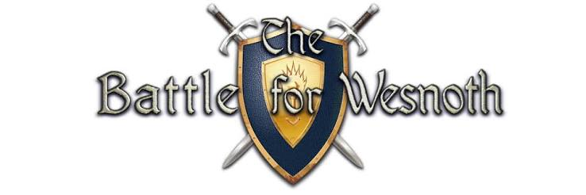

# The Battle for Wesnoth — Game Localization QA

  

Independent QA case study focused on evaluating the English → Spanish localization of **The Battle for Wesnoth**, an open-source turn-based tactical strategy game.

The project focused on localization quality, linguistic accuracy, terminology, register consistency, contextual meaning, and UI text presentation.

---

## Project Overview

| Item | Details |
|---|---|
| **Game** | The Battle for Wesnoth |
| **Version** | 1.18.8 |
| **Target language** | Spanish |
| **Testing type** | Localization QA / Exploratory Testing |
| **Project status** | Completed |

### Coverage

Testing focused primarily on the **Tutorial Campaign**, with additional exploratory coverage of selected content from **A Tale of Two Brothers**.

Areas evaluated included:

- Tutorial dialogue and instructions
- Victory and defeat messages
- Main Menu gameplay tips
- Help documentation
- Game terminology
- Player-address and register consistency
- Grammar and punctuation
- Translation accuracy and contextual meaning
- UI text presentation and truncation
- Save, load, and autosave functionality

---

## Results

### 4 Confirmed Localization Defects

| ID | Area | Issue |
|---|---|---|
| **L10N-001** | Tutorial | Inconsistent and ambiguous player address in defeat message |
| **L10N-002** | Tutorial | Ambiguous and inconsistent player address in victory message |
| **L10N-003** | Main Menu Tips | Mixed informal and formal player address |
| **L10N-004** | Campaign Dialogue | Incorrect question punctuation and missing definite article |

**[View confirmed bugs →](Bugs.md)**

### 8 Localization Observations

Additional findings related to wording, readability, UI presentation, and localization quality that did not meet the criteria for confirmed defects.

**[View localization observations →](Localization-Observations.md)**

### 16 Investigated and Discarded Cases

Potential issues were investigated and discarded when they were confirmed as valid translations, contextual choices, established terminology, controlled UI behavior, or cases where evidence was insufficient to confirm a defect.

**[View discarded cases →](Discarded-Cases.md)**

---

## QA Approach

The investigation combined:

- Exploratory localization testing
- English → Spanish source comparison
- Linguistic and grammatical validation
- Terminology and consistency analysis
- Contextual interpretation
- UI localization review
- Defect reproduction and documentation
- Evidence-based classification of findings

A key part of the investigation was distinguishing **confirmed localization defects from valid translations, stylistic observations, and false positives**.

---

## Key QA Skills Demonstrated

**Localization QA · Exploratory Testing · English → Spanish Comparison · Linguistic Validation · Terminology Analysis · Register Consistency · UI Localization · Defect Documentation · Evidence-Based Analysis · False Positive Identification**

---

## Evidence

Screenshots supporting the four confirmed defects are available in the [`Evidence/`](Evidence/) folder and are referenced directly from [`Bugs.md`](Bugs.md).

---

## Project Context

This was an **independent portfolio project** created to demonstrate practical QA and Localization QA skills.

It was not performed as part of the official development or QA team of The Battle for Wesnoth.

---

## About The Battle for Wesnoth

Special thanks to the **The Battle for Wesnoth** open-source community for creating and maintaining the game that served as the subject of this independent QA case study.

Interested in trying the game or exploring the project?

- **[Download The Battle for Wesnoth](https://www.wesnoth.org/)**
- **[Official GitHub Repository](https://github.com/wesnoth/wesnoth)**

The game is open source and available for Windows, macOS, and Linux.
